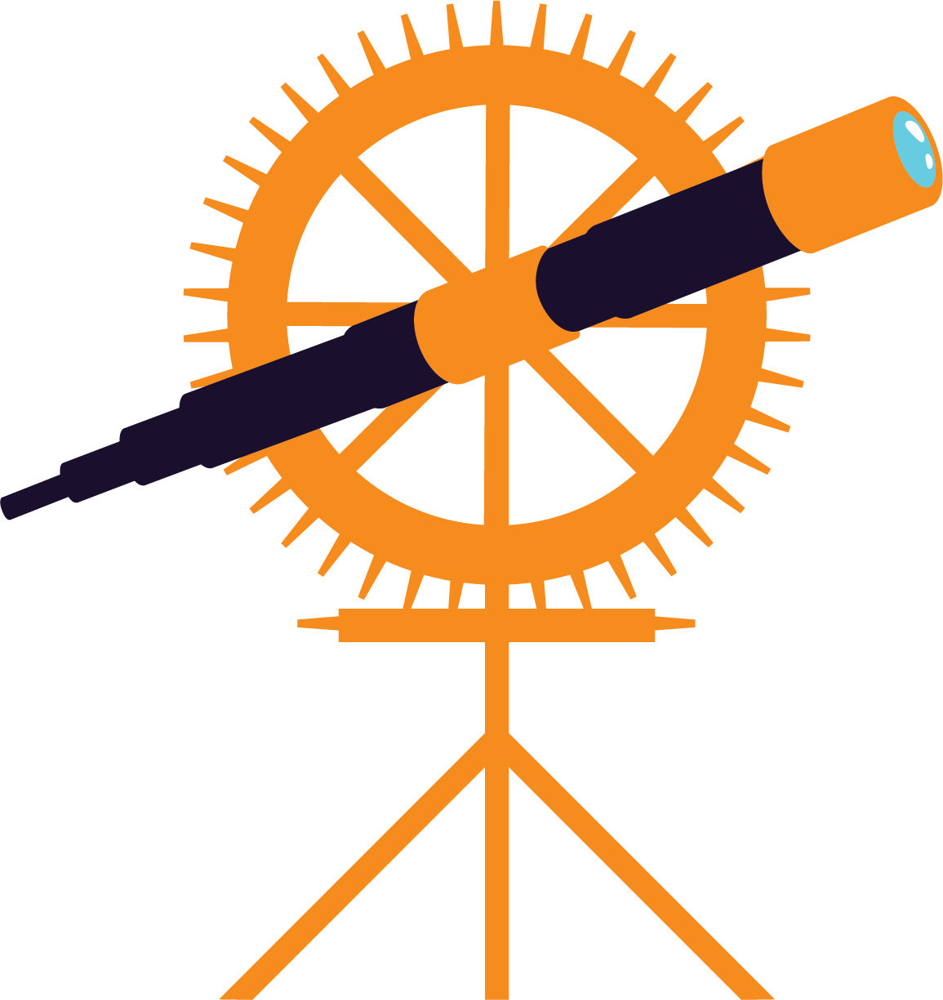
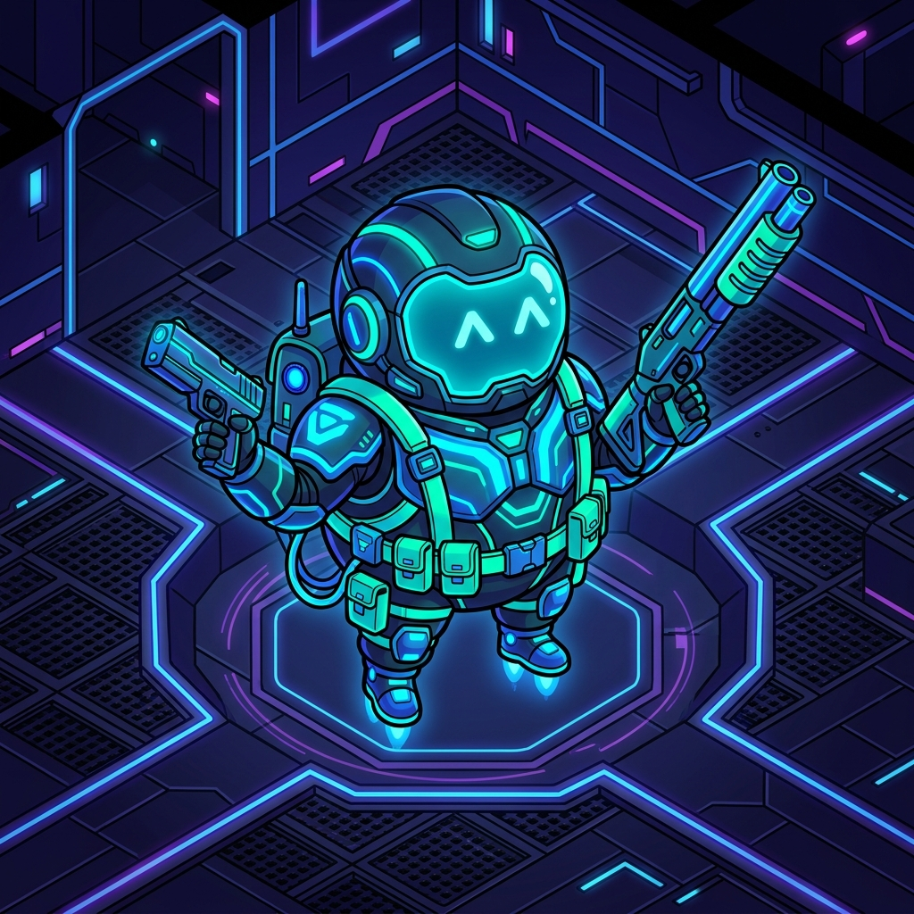

# 🌌 Sleepy Shooters
### *Tactical 2D Twin-Stick Acoustic Roguelike Co-Op Shooter*

 

 

**[ 📥 Download Latest Windows Build (.zip)](https://github.com/Sleepy-Star-Studio/sleepy-shooters-releases/releases/latest) • [ 🎮 Controls Cheatsheet](#-controls-cheatsheet) • [ ✨ Feature Breakdown](#-core-features)**

---

## 📖 About the Game

**Sleepy Shooters** is a fast-paced, top-down multiplayer roguelike shooter built in **Godot 4**. Players deploy as robotic operatives into mysterious procedural labyrinths, managing spatial sound echoes, tight-corridor mob crowds, and escalating horde waves with full worldwide co-op support.

### 🤖 An AI-Driven Learning & Engineering Experiment
> [!NOTE]
> **Sleepy Shooters** was conceived, designed, and developed as an experimental learning project exploring the frontiers of **Human-AI Agentic Pair Programming** with **Google DeepMind's Antigravity**. 
> 
> From procedural maze generation algorithms and spatial audio shaders to authoritative Steam P2P netcode, crowd physics, and mid-session spectator tracking—the architecture, GDScript code, vector SVG assets, and network protocols were co-authored iteratively through conversational agentic pair programming.

---

## ✨ Core Features

### 🏰 1. Procedural 9-Screen Labyrinths
* Deterministic seed-based generation guarantees that all connected players explore identical 3×3 maze layouts with zero level loading delays.
* Dynamic airlock rooms, mob spawners, and secured exit chambers that unlock only when all threats are neutralized.

### 🔊 2. Spatial Acoustic Radar & Echo Waves
* **Sound is your radar**: Gunfire, sprinting footsteps, wall pushes, and monster roars generate circular acoustic wave shaders across the maze.
* Planar vector radar minimap visualizes sound ripples in real time to locate distant swarms and extraction points.

### 🛡️ 3. Squeeze & Push Physics
* Dynamic compressible hitboxes allow operatives to squeeze through tight enemy gaps (up to 40% compression) while pushing through crowds with momentum-based physics.
* Kinetic impulse recoil on weapons delivers satisfying knockback against advancing swarms.

### 🎭 4. Operative Customization & Toon Roster
* **4 Selectable Toons**:
  * 🤖 **Astro Bot**: Classic balanced combat operative with tactical visor.
  * 🐱 **Ninja Cat**: Infiltration scout with pointed cat ears and forehead star emblem.
  * 🛡️ **Heavy Mecha**: Juggernaut tank with reinforced blast shield and armor hull.
  * 👾 **Alien Scout**: Cosmic vanguard with top antenna orb and starry cyclops eye.
* **8-Color Neon Tint Palette**: Neon Cyan, Toxic Emerald, Solar Gold, Crimson Blaze, Cyber Violet, Cobalt Blue, Hyper Orange, and Pure White.
* Real-time multiplayer synchronization and automatic profile persistence.

### 👁️ 5. Mid-Session Spectator Mode
* Late-joining players entering during active combat are safely placed in **Spectator Mode** (invisible, collision disabled, camera smoothly tracking living teammates).
* Cycle between surviving teammates using `[A] / [D]` or Left/Right Click until the round concludes, then receive cumulative catch-up upgrade points to spend in the depot!

### 🌐 6. Dual-Mode Networking: Steam Worldwide & Local LAN
* 🌐 **Steam P2P Matchmaking**: Worldwide lobby browser and 1-click matchmaking via Steamworks.
* ⚡ **Direct Connect / LAN**: Built-in loopback support on port `8910` (ENet) for instant multi-instance side-by-side local testing with zero Steam dependencies.

### ⭐ 7. Intermission Upgrade Depot & Titan Boss Battles
* Survive wave rounds to earn upgrade points for Max Health, Sprint Speed, Ammo Capacity, and Fire Rate.
* Confront terrifying mutated behemoths every 5 rounds, including the multi-phase **Abomination Titan** with ground-burrowing ambush mechanics!

---

## 🚀 How to Run (Windows x64)

1. Head to the **[Releases Page](https://github.com/Sleepy-Star-Studio/sleepy-shooters-releases/releases)**.
2. Download the latest **`SleepyShooters_Windows_x64.zip`**.
3. Extract the `.zip` archive to a folder on your PC.
4. Double-click **`SleepyShooters.exe`** to launch!
   * *Tip*: Ensure Steam is running in the background for Steam lobby matchmaking; otherwise, choose **Local / LAN** to host/join offline!

---

## 🧭 Controls Cheatsheet

| Action | Keyboard / Mouse | Gamepad / Controller |
| :--- | :--- | :--- |
| **Move / Push / Squeeze** | `W, A, S, D` | **Left Joystick** |
| **Aim 360°** | **Mouse Cursor** | **Right Joystick** |
| **Shoot Weapon** | **Left Click** / `Space` | **R2 (Right Trigger)** |
| **Reload Weapon** | **`R`** | **`◻ Square` / X (Tap)** |
| **Swap Weapon** | **`TAB`** | **`▲ Triangle`** / Y |
| **Cycle Spectator Target** | **`[A] / [D]`** or **Left/Right Click** | **`LB / RB Bumpers`** |
| **Open Upgrade Depot** | **`U`** or HUD Button | — |
| **Toggle Minimap Radar** | **`M`** | — |
| **In-Game Chat / Admin** | **`T`** or **`[Enter]`** | — |
| **Camera Zoom In / Out** | **Mouse Wheel / Trackpad Pinch** | **`D-Pad Up` / `D-Pad Down`** |
| **Launch Round (Pad)** | **Walk onto Center Pad (or Press [E])** | **Walk onto Center Pad (or Press ◻)** |
| **Revive Teammate** | **`E` (Hold 1.5s)** | **`◻ Square` / X (Hold)** |
| **Settings / Pause** | **`ESC`** | **`Start / Options`** |

---

## 🏢 Sleepy Star Studio

Created with ❤️ by **Sleepy Star Studio** in collaboration with **Antigravity**.

* 🔗 Main Source Repository *(Private)*: `Sleepy-Star-Studio/godot-sleepy-shooters`
* 📦 Public Client Releases: [Sleepy-Star-Studio/sleepy-shooters-releases](https://github.com/Sleepy-Star-Studio/sleepy-shooters-releases)
